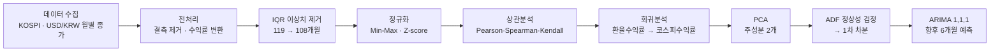

# 📊 원/달러 환율이 코스피에 미치는 영향 분석

> **2016~2025년 KOSPI 지수와 USD/KRW 환율(월별)로 "환율 변동이 코스피 수익률에 미치는 영향"을 정량 분석한 시계열 데이터 분석 프로젝트.** 상관분석 → 회귀 → PCA → ARIMA 예측까지 수행하고 **KIPS 학술발표대회 양식 논문**으로 정리했습니다.


📄 논문 전문: [`paper/paper_kr.pdf`](paper/paper_kr.pdf) · 📓 분석 코드: [`analysis.ipynb`](analysis.ipynb) · 📅 개발 기간: 2025.09 ~ 2025.12

---

## 📈 한눈에 보는 결과 (Demo)


> 환율 수익률과 코스피 수익률은 **세 가지 상관계수 모두에서 음(-)의 관계**를 보였고, 회귀로 그 크기를 정량화했습니다.

| 핵심 발견 | 수치 |
|---|---|
| 환율↑ → 코스피 수익률↓ (Pearson) | **−0.407** |
| 회귀계수 β₁ (환율 1%↑ 시 코스피 수익률 변화) | **−0.856** |
| 환율이 설명하는 코스피 수익률 변동 (R²) | **16.6%** |
| ARIMA(1,1,1) 향후 6개월 KOSPI 예측 | **완만한 상승 추세** |

---

## 🧩 연구 질문

1. 환율 변동과 코스피 수익률 사이에 상관성이 존재하는가?
2. 환율 수익률이 코스피 수익률을 얼마나 설명하는가?
3. 시계열 예측에서 두 변수의 관계는 어떤 패턴을 보이는가?

데이터의 "수준(level)"끼리 비교하면 스케일 차이로 관계가 가려지므로, **수익률(변화율)**로 변환해 두 자산의 동적 관계를 본 것이 핵심 관점입니다.

---

## 🛠️ 기술 스택 & 선정 이유

| 분류 | 기술 | 선정 이유 (왜) |
|---|---|---|
| 데이터 처리 | **pandas / numpy** | 시계열 정렬·결측 처리·수익률 변환을 벡터 연산으로 간결하게 |
| 상관분석 | **scipy.stats** | Pearson·Spearman·Kendall 세 가지를 한 번에 — 선형/순위 관계를 교차 검증 |
| 회귀분석 | **scikit-learn** | 단순 선형회귀로 β·R²를 표준 API로 산출, 설명 가능성 확보 |
| 차원축소 | **scikit-learn (PCA)** | 4개 변수의 변동을 소수 주성분으로 압축해 구조를 해석 |
| 시계열 예측 | **statsmodels (ADF·ARIMA)** | 정상성 검정(ADF)부터 ARIMA까지 통계적 시계열 분석을 한 패키지로 |
| 시각화 | **matplotlib** | 상관 히트맵·회귀선·예측 구간 시각화 |

> 데이터 출처: **Investing.com**의 KOSPI 지수 / USD/KRW 월별 종가 (2016.01 ~ 2025.11, 119개월).

---

## 🔬 분석 파이프라인



---

## 📊 분석 결과 / 성능 지표

> 아래 수치는 모두 [`analysis.ipynb`](analysis.ipynb) 실행 산출값입니다.

### 1) 상관분석 — 환율 수익률 vs 코스피 수익률

| 상관계수 | 값 | 해석 |
|---|---|---|
| Pearson | **−0.407** | 선형적 음의 상관 |
| Spearman | **−0.427** | 순위 기준 음의 상관 |
| Kendall | **−0.291** | 순위 일치도 기준 음의 상관 |

→ 세 지표 모두 음수로 **"환율이 오르면 코스피 수익률은 내린다"**는 방향이 일관되게 확인됨.

### 2) 회귀분석 (환율 수익률 → 코스피 수익률)

| 지표 | 값 |
|---|---|
| 회귀계수 β₁ | **−0.8562** |
| 절편 β₀ | 0.0094 |
| 결정계수 R² | **0.1660** |

→ 환율 수익률 1% 상승 시 코스피 수익률 평균 약 0.86%p 하락. 환율 단독으로 코스피 수익률 변동의 **약 16.6%**를 설명 (나머지는 환율 외 요인 — 단일 변수 모델의 한계).

### 3) PCA (주성분 분석)

| 주성분 | 설명 분산 비율 | 주요 구성 |
|---|---|---|
| PC1 | **36.97%** | 코스피 수익률(+0.72) vs 환율 수익률(−0.52) — 단기 변동 축 |
| PC2 | **34.98%** | 코스피·환율 수준(close) 중심 — 장기 추세 축 |

→ 두 주성분이 전체 변동의 **약 72%** 설명.

### 4) ARIMA(1,1,1) 시계열 예측 (KOSPI 종가)

| 항목 | 값 |
|---|---|
| 모델 | ARIMA(1,1,1) · 관측치 119 |
| AR.L1 / MA.L1 | 0.863 (p=0.004) / −0.776 (p=0.021) — 둘 다 유의 |
| AIC / BIC | 1502.4 / 1510.7 |
| 향후 6개월 예측 | 4,162 → 4,401pt (**완만한 상승**) |

**결론** — 환율은 코스피의 *절대 수준*보다 *단기 수익률 변동*에 영향을 주는 핵심 요인이며, 음(-)의 관계가 세 상관계수·회귀에서 일관되게 나타났다.

---

## 🔧 트러블슈팅 / 의사결정

| 문제 | 해결 |
|---|---|
| KOSPI(900~4,100pt)와 환율(950~1,460원)은 스케일이 달라 직접 비교 불가 | **수익률 변환 + 정규화**로 동적 관계 비교 → 음의 상관이 명확히 드러남 |
| 이상치·노이즈로 회귀 왜곡 우려 | **IQR 기반 이상치 제거** (119 → 108개월)로 회귀 안정화 |
| 원시 시계열은 비정상(Non-Stationary) → ARIMA 신뢰 불가 | **ADF 검정**으로 비정상 확인 후 **1차 차분**으로 정상성 확보 |

<details>
<summary><b>왜 ARIMA(1,1,1)이고, 정상성 근거는?</b> (펼치기)</summary>

- **ADF 검정 (원시 종가):** KOSPI p=0.647, USD/KRW p=0.908 → 둘 다 p≥0.05로 **비정상**.
- **1차 차분 후:** USD/KRW p≈3.1e-12 (정상), KOSPI 차분 p=0.0518로 5% 경계선 → ARIMA의 `d=1`(1차 차분) 채택 근거.
- **차수 선택:** 차분(d=1) 후 AR(1)·MA(1)을 적용한 ARIMA(1,1,1)에서 AR.L1·MA.L1 계수가 모두 통계적으로 유의(p<0.05).
- **참고:** 수익률 시계열은 이미 정상(ADF p<1e-4)이라, 수익률에는 차분이 불필요한 ARIMA(1,0,1)을 별도로 적용해 교차 확인함.

</details>

---

## ▶️ 재현 방법

```bash
git clone https://github.com/SkyWith628/kospi-exchange-analysis.git
cd kospi-exchange-analysis

pip install pandas numpy scipy scikit-learn statsmodels matplotlib jupyter
jupyter notebook analysis.ipynb   # 셀을 위에서부터 순서대로 실행
```

```
kospi-exchange-analysis/
├── analysis.ipynb       # 전처리 → 상관 → 회귀 → PCA → ARIMA 전체 분석
├── data/
│   ├── kospi.csv        # KOSPI 지수 월별 종가 (Investing.com)
│   └── usd_krw.csv      # USD/KRW 환율 월별 종가
├── paper/paper_kr.pdf   # KIPS 학술발표대회 양식 논문
└── assets/results.png   # 분석 결과 시각화
```

---

## 🪞 회고 & 학술발표 성과

- **수준이 아닌 수익률로 보기**: 절대 수준 비교에선 안 보이던 음의 상관이 수익률 변환 후 드러난 것이 가장 큰 배움. 같은 데이터도 어떤 표현으로 보느냐가 결론을 바꾼다는 점을 체감.
- **통계적 가정의 중요성**: ARIMA를 쓰기 전 ADF로 정상성을 먼저 검정하는 절차의 필요성을 직접 경험. "모델을 돌리기 전에 데이터의 전제를 검증한다"는 습관을 들임.
- **한계 인식**: R²=0.166은 환율이 단일 요인으로는 설명력이 제한적임을 보여줌 → 금리·외국인 수급 등 다변량 확장이 후속 과제.
- **학술발표**: 본 분석을 **KIPS(한국정보처리학회) 학술발표대회 양식 논문**([`paper/paper_kr.pdf`](paper/paper_kr.pdf))으로 정리 — 연구 질문 설정부터 결론 도출까지 학술 형식으로 구조화.

---

*인덕대학교 컴퓨터소프트웨어학과 · 2025 데이터분석 프로젝트 (KIPS 학술발표 양식 논문 포함)*
