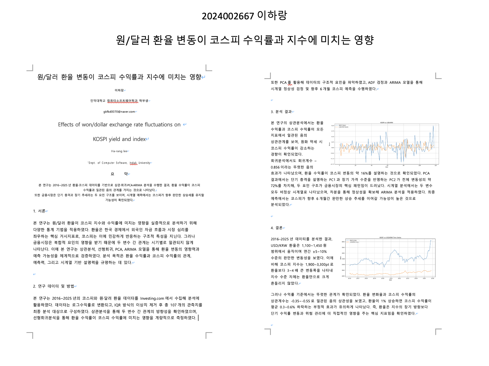

# 📊 원/달러 환율이 코스피에 미치는 영향 분석


> **2016~2025년 KOSPI와 USD/KRW 데이터로 환율 변동이 코스피 수익률·지수에 미치는 영향을 정량 분석한 데이터 분석 프로젝트.**
> 상관분석 → 회귀분석 → PCA → ARIMA 시계열 예측까지 수행하고 **학회 논문(KIPS 학술발표대회 양식)**으로 정리했습니다.

📄 논문 전문: [`paper/paper_kr.pdf`](paper/paper_kr.pdf) · 📓 분석 코드: [`analysis.ipynb`](analysis.ipynb)

📅 **개발 기간:** 2025.09 ~ 2025.12 (2학년 2학기)

---

## 🧩 연구 질문

1. 환율 변동과 코스피 수익률 사이에 상관성이 존재하는가?
2. 환율 수익률이 코스피 수익률을 얼마나 설명하는가?
3. 시계열 예측에서 두 변수의 관계는 어떤 패턴을 보이는가?

## 🔬 분석 방법

| 단계 | 방법 | 도구 |
|---|---|---|
| 전처리 | 결측치 제거 · **IQR 이상치 제거** · Min-Max / Z-score 정규화 | pandas, numpy |
| 상관분석 | Pearson · Spearman · Kendall | scipy |
| 회귀분석 | 단순 선형회귀 (환율 수익률 → 코스피 수익률) | scikit-learn |
| 차원축소 | PCA 주성분 분석 (2개 주성분) | scikit-learn |
| 시계열 | ADF 정상성 검정 → 차분 → **ARIMA(1,1,1)** 예측 | statsmodels |

> 데이터: Investing.com의 KOSPI 지수 / USD/KRW 종가 (월별 119개 → 이상치 제거 후 107개)

## 📈 핵심 결과



- **음의 상관관계 확인** — 세 상관계수(Pearson·Spearman·Kendall) 모두 환율↑ → 코스피 수익률↓
- **회귀: β = -0.856** (유의) — 환율 1% 상승 시 코스피 수익률 평균 0.8% 감소, R² = 0.166 (환율이 코스피 변동의 약 16% 설명)
- **PCA** — PC1(36.97%, 단기 충격) + PC2(34.98%, 장기 추세)로 변동의 약 72% 설명
- **ARIMA(1,1,1)** — 코스피는 향후 6개월 완만한 상승 추세 예측
- **결론** — 환율은 코스피의 *절대 수준*보다 *단기 수익률 변동*에 영향을 주는 핵심 요인

## 🔧 분석하며 부딪힌 점과 해결

| 문제 | 고민 | 해결 |
|---|---|---|
| **지수끼리 직접 비교 불가** — KOSPI(900\~3300pt)와 환율(950\~1450원)은 스케일·변동성이 너무 다름 | 절대 수준을 그대로 비교하면 관계가 안 보임 | **수익률(변화율)로 변환 + 정규화**(Min-Max·Z-score) 후 비교 → 수준에선 안 보이던 음의 상관이 수익률에서 명확히 드러남 |
| **이상치·결측으로 회귀 왜곡** | 어떤 기준으로 이상치를 거를까 | **IQR 기반 제거**로 119개 중 107개만 사용, 노이즈 줄여 회귀 안정화 |
| **시계열 비정상성** — 원시 데이터로 ARIMA 적용 시 예측이 신뢰 불가 | 정상성을 어떻게 확보하나 | **ADF 검정**으로 비정상성 확인 → **차분** 후 정상성 확보 → ARIMA(1,1,1) 적용 |

## 📁 구성

```
kospi-exchange-analysis/
├── analysis.ipynb       # 전처리 → 상관 → 회귀 → PCA → ARIMA 전체 분석
├── data/
│   ├── kospi.csv        # KOSPI 지수 월별 종가 (Investing.com)
│   └── usd_krw.csv      # USD/KRW 환율 월별 종가
├── paper/paper_kr.pdf   # KIPS 학술발표대회 논문 (요약·결과·결론)
└── assets/results.png   # 분석 결과 시각화
```

## ▶️ 실행

```bash
pip install pandas numpy scipy scikit-learn statsmodels matplotlib jupyter
jupyter notebook analysis.ipynb
```

---

*인덕대학교 컴퓨터소프트웨어학과 · 2025 데이터분석 프로젝트 (KIPS 학술발표 양식 논문 포함)*
